# PreProgetto di Dipartimento di Primo Soccorso, Pronto Soccorso e Dipartimento di Urgenza, Emergenza e Accettazione

_a cura di Cesare Catavitello_

###Introduzione

 Quello che viene comunemente detto pronto soccorso, è uno dei luoghi nevralgici dell'intero Sistema Ospedaliero. Esso infatti è il luogo in cui si accoglie e direziona all'interno della struttura la maggior parte dei pazienti. Vi si stabilisce anche il periodo di osservazione necessario per definire la diagnosi e trattamento. Ogni paziente rappresenta una determinata situazione clinica che viene inserita in una apposita classifica, detta _Triage_ che ne stabilisce il grado di urgenza e quindi la rispettiva priorità di assistenza da parte del personale ospedaliero. Nel presente progetto verrà spiegato il significato dei codici che vengono usualmente assegnati. Questa partizione in codici permette ti delimitare il dipartimento di pronto soccorso  in determinate aree in cui vengono assistiti tutti i pazienti con il giusto criterio di priorità. Dopo aver spiegato la suddivisione in codici, verranno esposte le aree di dipartimento spiegandone il loro funzionamento. Esitono nel mondo diverse modalità di organizzazione del dipartimento di pronto soccorso, che riflettono le peculiari condizioni socio-economiche, culturali e sanitarie specifiche di quella determinata popolazione. Nel presente progetto ci si ispira a quello dell'ospedale San Filippo Neri di Roma non riproducendo con fedeltà la disposizione costruttiva. Si aggiungono e rimuovono anche alcune aree al fine di rendere il progetto più efficiente da un punto di vista organizzativo.
Infine verranno mostrati alcuni progetti di pronto soccorso che permettano di dare un'idea generale della struttura.

 
 
  
##Il  _Triage_
 
Come detto esso rappresenta una scala che permette di stabilire la priorità di cura di un determinato assistito.
Obiettivi principali del Triage sono quelli di assicurare un ordine di assistenza all'interno della struttura, smistare i pazienti non urgenti assicurando nel contempo la migliore assistenza possibile nei confronti dei pazienti critici. Il grado di criticità viene generalmente espresso attraverso l'utilizzo di quattro colori:
 
* **Bianco**
* **Verde**
* **Giallo** 
* **Rosso**.

Il codice Bianco esprime che il paziente non ha necessità del pronto soccorso e può quindi rivolgersi al proprio medico.
Il codice Verde invece che il paziente riporta delle lesioni che non interessano le funzioni vitali ma vanno curate.
Il codice Giallo che il paziente presenta una compromissione parziale delle funzioni dell'apparato circolatorio o respiratorio, non c'è un apparente pericolo di vita immediato.
Il codice Rosso  indica un soggetto con almeno una delle funzioni vitali (coscienza, respirazione, battito cardiaco, stato di shock) compromessa ed è in potenziale immediato pericolo di vita.
Il codice di Triage o di priorità nella assistenza viene determinato nelle aree di accoglienza oppure durante il trasporto di infermi da parte del personale a bordo delle autoambulanze.

##Le Aree:

###Area Triage in Pronto Soccorso
Postazione di triage globale-avanzato per accoglienza, accettazione e codificazione di tutti i pazienti che accedono al Pronto Soccorso.
E' la prima area con la quale gli assistiti devono entrare in contatto.
Essa è dotata di Helpdesk informativo che attraverso una prima visita da parte del personale, in una stanza adiacente alla hall di ingresso, stabilisce il codice del paziente.
L' accoglienza è composta dalle seguenti attrezzature: desk informativo con computer, schermi LCD informativi, macchinette, distributore d'acqua, sedie per l'attesa e bagno(maschile e femminile).
La Stanza adiacente dedicata alla prima visita contiene lettino, monitor, computer, carrello di terapia(i.e. mobiletti semovibili caricati dell'utile per svolgere le mansioni).
Solitamente in quest'area vi è posizionata anche una guardiola di sicurezza.
E' l'unica Area disponibile al publico.

###Area Emergenza in Pronto Soccorso per “Pazienti Critici” (centrale, principale con corridoio preferenziale)

L'area di emergenza:

* è il punto di primo impatto nella relazione tra utente  Struttura Sanitaria Ospedaliera;
* è caratterizzata da un incremento progressivo egli accessi che si riflette sulla quantità e qualità delle prestazioni erogate (questo infatti è un elemento di forte criticità);
* è in se uno dei principali indicatori di efficienza di una organizzazione sanitaria all'avanguardia.

E' una sala “Emergency Room” sul modello “open space” , con  almeno sei postazioni monitorizzate(comprensive di lettino, flebo e macchinario monitor, defibrillatore, macchinari vari), identificabile come SALA EMERGENZA 1. E' dove vengono assistiti i codici rosso pertanto il raggiungimento di questa area deve essere il più diretto possibile, pertanto è necessario adibire una corsia preferenziale che la connetta con la accoglienza.

###Area Emergenze-Urgenze Mediche e Traumatologiche

Sala Visita per Codici Gialli e Verdi.
Essa è comprensiva di almeno due  postazioni monitorizzate(vedi area precedente), un computer, paravento, carrelli di terapia e lettini semplici.
Quest'area non necessita di una corsia preferenziale e pertanto può essere posizionata in prossimità delle aree di visita per i codici meno gravi come ad esempio l'Area Visita.

###Area Visita
E' l'area ambulatoriale del reparto di pronto soccorso dove vengono trattati i codici di minore gravità, verdi e bianchi.
Consta di una sala di attesa secondaria comprensiva di sedie.
Due stanze dotate di lettino materiale, diagnostico(macchinari), sedia, scrivania e computer. Una stanza è per esigenze di carattere chirurgico e l'altra per esigenze di carattere mediche.

###Area Accoglienza e visita pazienti con patologia psichiatrica o infettiva (accanto Area Holding)
E' dove vengono visitati ed eventualmente assistiti pazienti con patologie di carattere psichiatrico o di carattere infettivo pertanto tale area è mediamente isolata e dotata di una guardiola di sicurezza per le evenienze.
Essa è strutturata come una comune area visita.

###Area Osservazione Temporanea (O.T.) cosiddetta  Area Letti Tecnici

Regione atta allo stazionamento di pazienti in attesa di definizione diagnostica, non rientranti per patologia e competenze nella O.B.I. e risolvibile al massimo entro le sei ore e dimissibili direttamente da PS. Tale area è composta da 3 stanze aventi rispettivamente 2 letti semplici per i pazienti. Tale area on necessita particolari strumentazioni.

###Area Holding 

 E' per pazienti destinati a ricovero con chiusura della cartella clinica in PS ma in attesa di posto letto, per mancanza di disponibilità. La suddetta area consta di due sale con un massimo di 6 letti monitorizzati (un maggior numero di macchinari per mantenere stabili i pazienti) ripsettivamente. Una sala è dedicata allo stazionamento uomini e l'altra allo stazionamento donne. Queste due sale saranno prospicienti ad una guardiola medica pronta ad intervenire, dotata di postazione informatica e monitor di osservazione sui pazienti.

###Area Osservazione Breve Intensiva ( O.B.I.)
Per stazionamento di pazienti non critici, né bisognosi di ricovero, con patologie di pertinenza, la cui definizione diagnostica non superi le 24-36 ore.
Comprende sei stanzoni aventi rispettivametne otto letti semplici non monitorizzati.

###Area Coordinamento e Follow Up delle urgenze 
Area dedita al trattamento ambulatoriale, controlli , per persone che non necessitano ricoveri o dimesse nell'area PS. 

###Area Radiologica di PS
Area di Radiologia tradizionale dotata dei macchinari necessari per eseguire Ecografie e TAC multislide appositamente dedicate.

###Farmacia (sinistra subito dopo la seconda sala di attesa )
Stanza medio/piccola dotata di mensole cariche di farmaci di varia necessità.

###Area Amministrativa di PS o AREA FAX (dopo la seonda sala di attesa)
Per il pronto smistamento di richieste per cure di II livello da parte dei PS e DEA afferenti per PTCA(Procedura di Rivascolarizzazione delle Coronarie) in corso di SCA,Trombolisi in corso di Ictus Ischemico, NIV e ventilazione assistita per pazienti con Insufficienze respiratorie e Sepsi.
In altre parole magazzino con presidi prettamente medici.

###Area Bucato (dopo la seconda sala di attesa)
Stanza piccola dei materiali di ricambio per letti, camici e igiene.

###Bagno interno
Bagno maschile e femminile dedicato a pazienti e medici non accessibile da parte del publico.

###Il mio progetto
Questo è la pianta del progetto senza la suddivisione delle stanze:
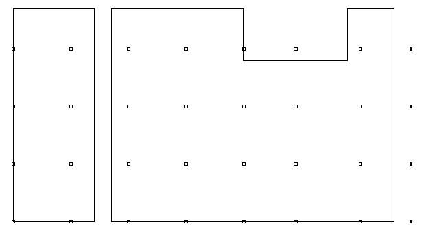

Nella suddivisione delle stanze si è cercato di ottenere una struttura che permetta il raggiungimento delle aree di necessità da parte del personale medico e da parte dei pazienti per qualsiasi livello di emergenza. La struttura è dotata anche  di aree di Servizio per il posizionamento del materiale tecnico ospedaliero nei momenti in cui l'uso non ne sia richiesto, una area di Lavanderia per ovviare alla ricorrente necessità di capi puliti all'intenro del reparto a prescindere del sistema di pulizia del bucato ospedaliero. Una area Farmacia è stata inserita per permettere alla struttura di fornirsi dei medicamenti necessari. Le altre aree sono state inserite seguendo i principi costruttivi espressi precedentemente.  

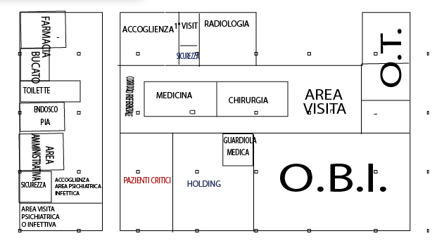

#Oggetti Renderizzati

### Carrello di terapia
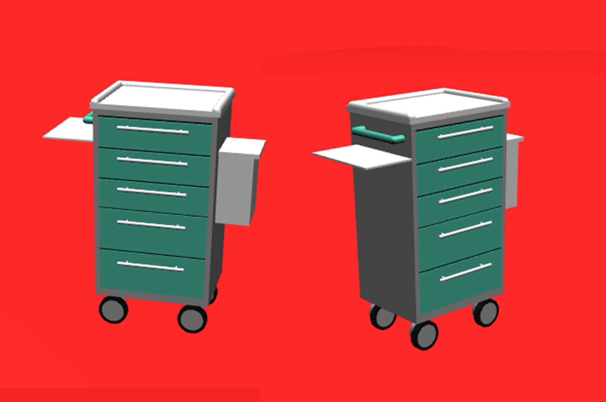

### Flebo

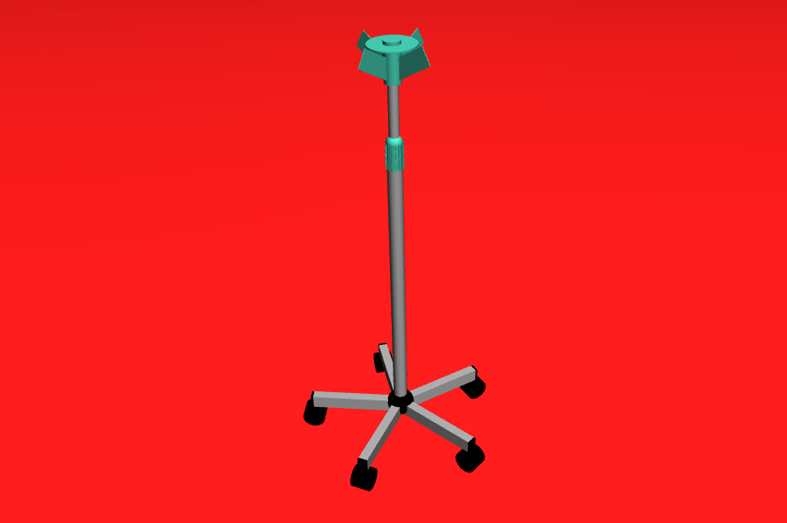

### Separè

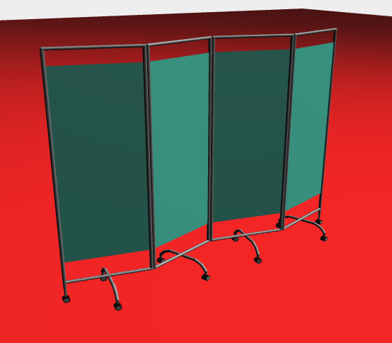

### Ecografo

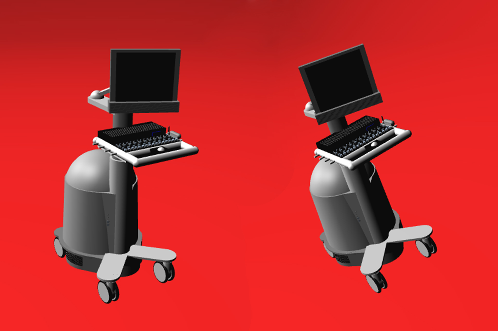

### Macchina per Tomografia Assiale Computerizzata (TAC)

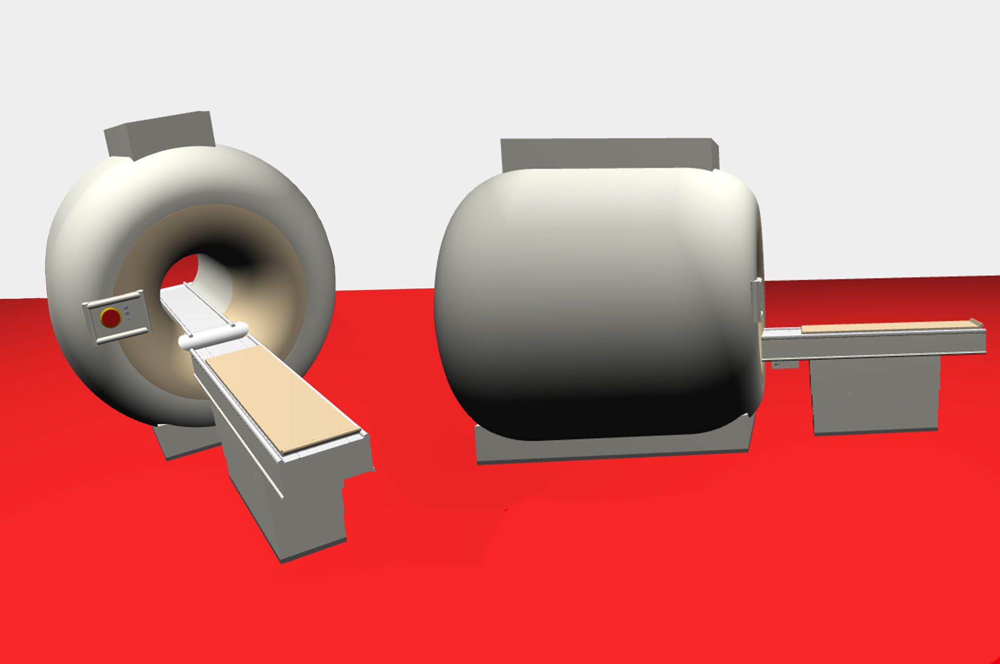

### Letto

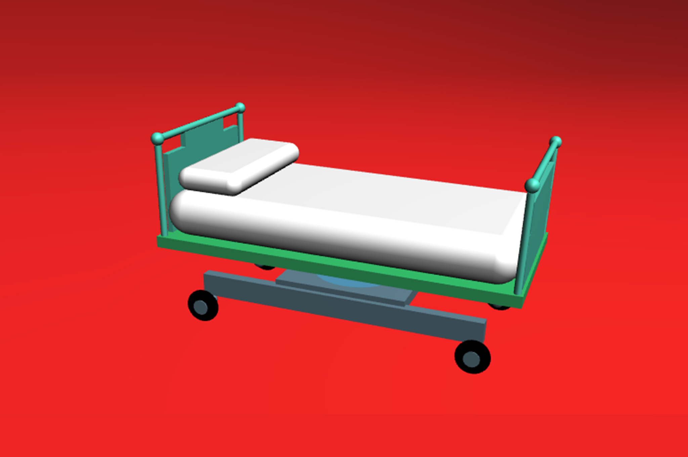

#### Lettino da visita

### Sedia da scrivania

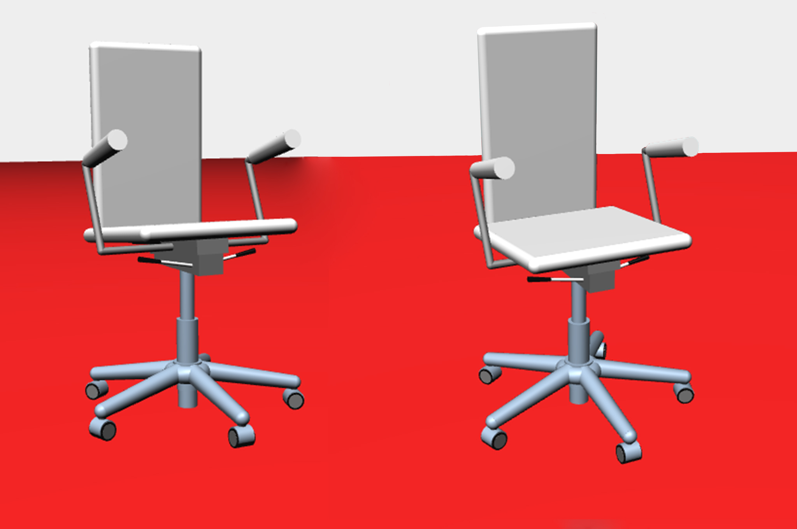

### SchermoLCD

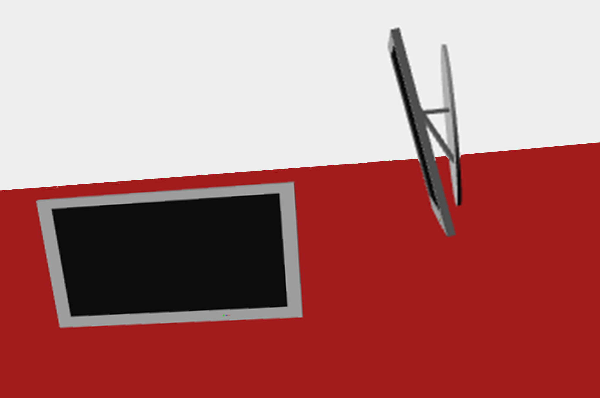

### Lavabo

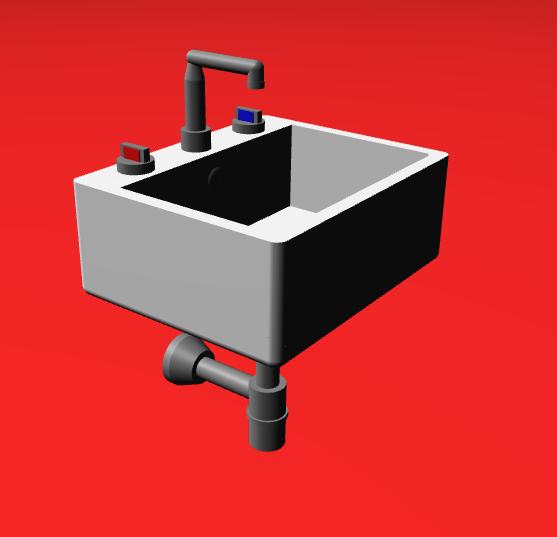

### Sanitario

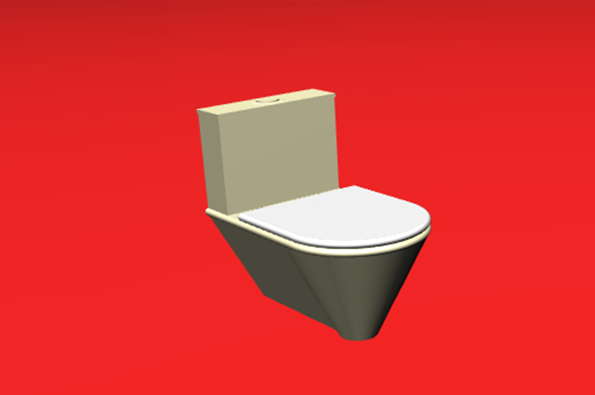

### Sedie per accoglienza

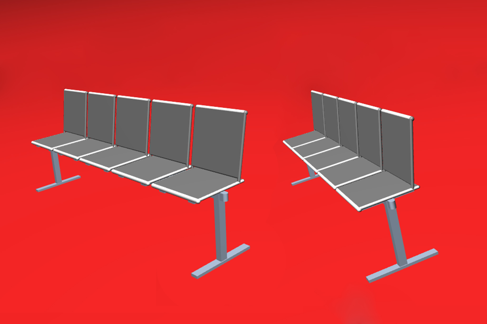

### Porta di sicurezza

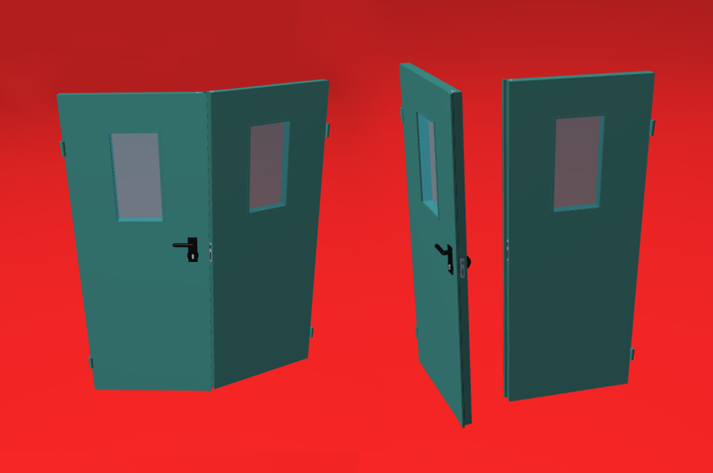

### Scrivania

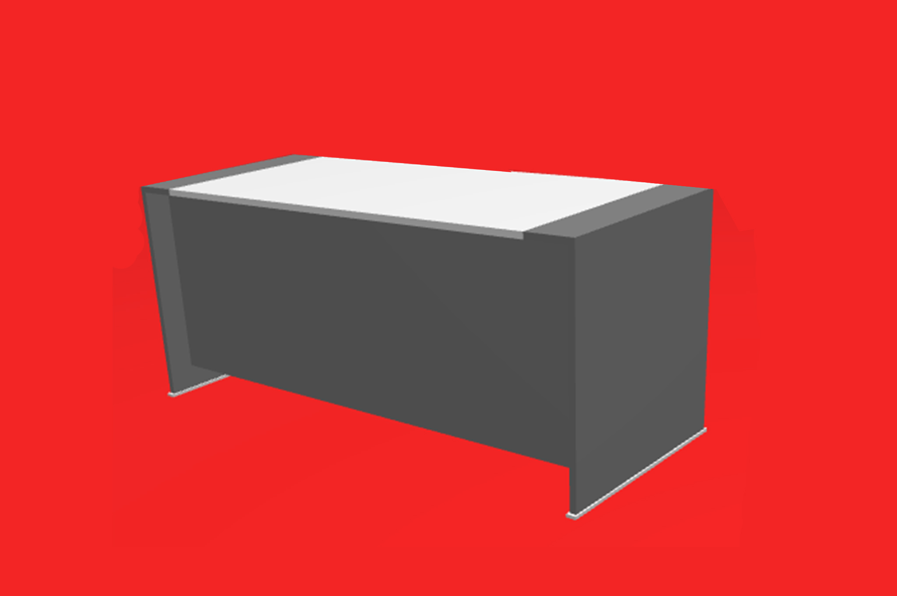

### Scaffale

### Armadietto per medicinali

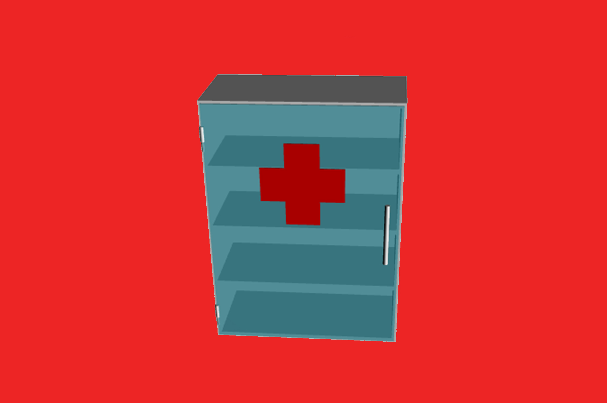

### Sedia a rotelle

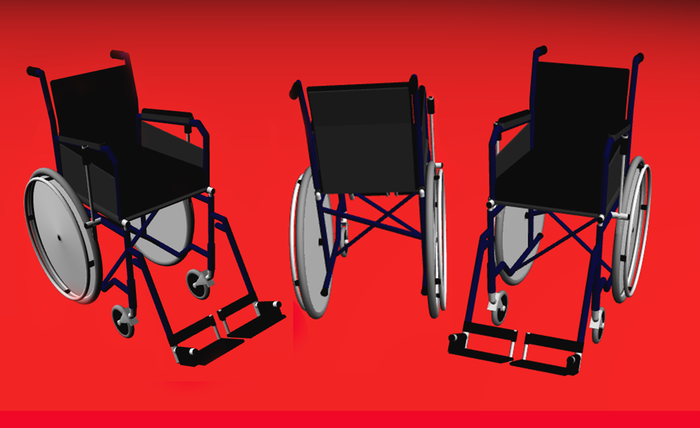

### Orologio

### Lavatrice

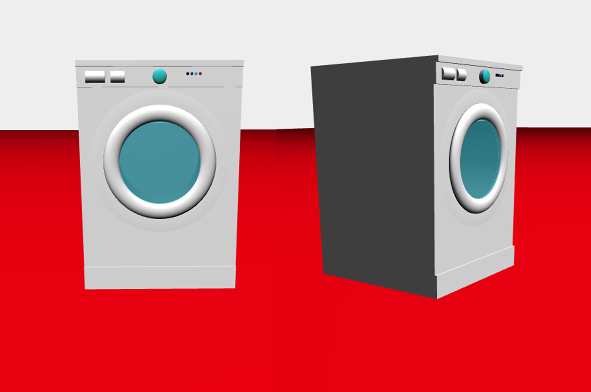

#Alcuni progetti di Pronto Soccorso
Di seguito sono riportati dei materiali reperiti in rete di progetti di pronto soccorso.

1.

Preso dal sito: <http://www.rochestergeneral.org/>

2.

Preso dal sito: <http://www.savancehealth.com>
3.

Preso dal sito: <http://www.filippolotti.it>

4.

Preso dal sito : <http://www.investigazioniscientifiche.it>

5.
![Progetto 5] (http://www.orvieto24.it/wp-content/uploads/2013/12/blocco2.png)
Preso dal sito : <http://www.orvieto24.it>

6.

Preso dal sito <http://quickspecmodular.com.au>

##Bibliografia
1. LAYOUT ARCHITETTONICO E ORGANIZZAZIONE DEL PRONTO SOCCORSO DI RIMINI a cura di : Dott. Marco Galletti, Dott.ssa Chiara Pesci,
AFD Claudia Semprini, I.P. Denise Garattoni
Pronto Soccorso e Medicina D'Urgenza Ospedale Infermi Rimini.

2. Informazioni prese dal sito <http://www.sanfilipponeri.roma.it/uoc_medicina_urgenza_pronto_soccorso.htm>